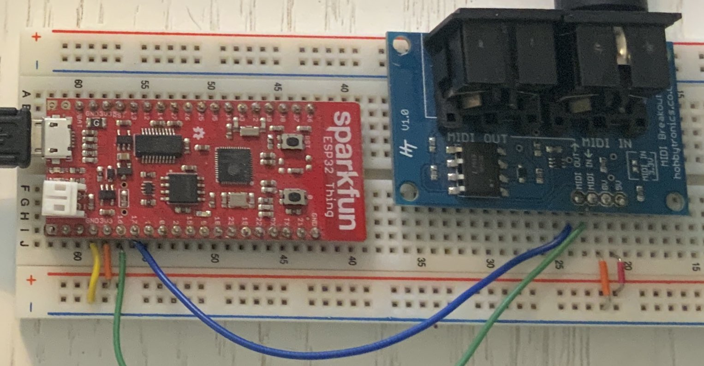

# midi

A MIDI [Musical Instrument Digital Interface] I/O library for the [Toit](https://toit.io) language.

You can use this to connect to

- Music keyboards or drum pads
- Synthesizers or drum machines
- (Some) guitar pedals
- AV and lighting rigs
- Devices with lots and lots of [knobs and sliders](https://us.novationmusic.com/products/launch-control-xl) … whether or not you want to use those for musical purposes

## Example

This program (adapted from `examples/thru.toit`) simply reads MIDI messages from the input and forwards them unchanged to the output, also logging them to the console.

```toit
import midi
import gpio

main:
    port := midi.SerialPort.uart --tx=(gpio.Pin 17) --rx=(gpio.Pin 16)
    while true:
        msg := port.receive
        port.send msg
        print "--> $msg"
```

## Hardware

Since Toit doesn't have a USB API yet, and I have no idea how to program Bluetooth, this library currently only supports old-school serial-line MIDI over dedicated cables.



You'll need one or two MIDI jacks to connect to the ESP32. The old school style is a circular 5-pin DIN connector, which you can get for a few bucks from places like [Adafruit](https://www.adafruit.com/product/1134). I'm not sure whether these have the opto-isolator called for in the MIDI standard, which prevents ground loops; nor am I sure how important that is. (The little breakout board in the photo, which does have an isolator, isn’t available anymore.)

Alternatively you can attach the more common [3-pin 1/8" TRS jacks](https://www.adafruit.com/product/1699), which are gradually replacing the big connectors. The good part is you can use regular stereo patch cable. The downsides are that you'll need a special adapter to connect to a device that has a DIN jack, and that (of course) there are two incompatible ways to connect the wires. [This site](https://minimidi.world) has all the details.

Either way, you just need to wire up the power and ground, connect the data pin(s) to GPIO pins, and tell the UART which pins to use. As you can see in the photo and example code, I used pin 17 for MIDI out and pin 16 for MIDI in, as recommended in the `uart` package docs.

If you want to run this on a desktop/laptop computer you'd think connecting would be simpler, but it's not. There are lots of MIDI interfaces available that plug into a USB port, but they identify themselves as MIDI interfaces, not regular serial ports. In my experience (on macOS) they don't show up as devices in `/dev`, so Toit can't [currently] connect. If anyone knows a workaround, please let me know!

## References

- [Official MIDI Specs](https://midi.org/specs) -- published by the MIDI Association. You'll need to register a free account to download these.
- [MIDI CC & NRPN Database](https://midi.guide) -- documents the CC and NRPN numbers used by various hardware.
- [minimidi.world](https://minimidi.world) -- guide to MIDI-over-TRS hardware support, and which devices are type A vs type B.
